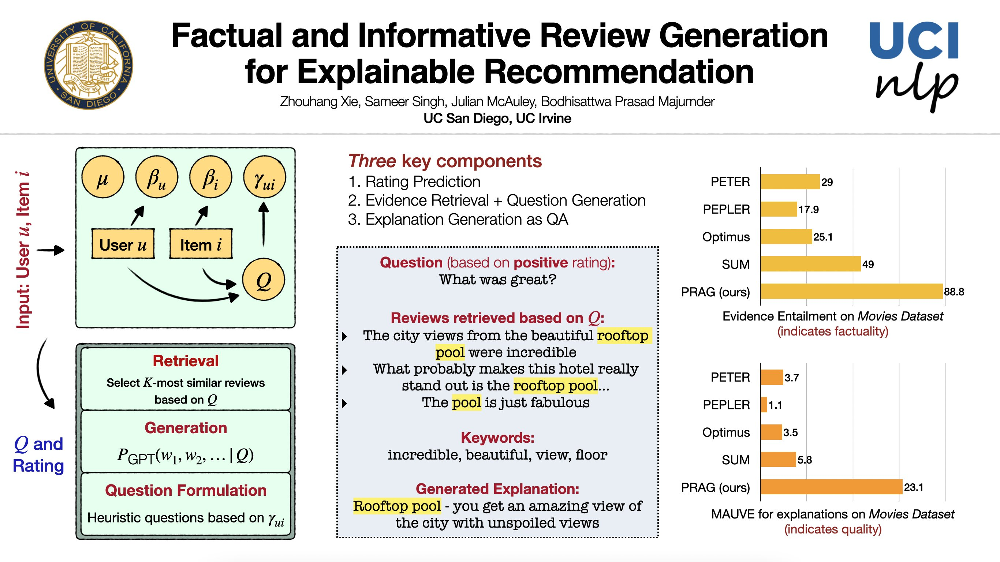

PRAG: Personalized Retrieval Augmented Generator for Explainable Recommendation
---

Directory for training components of PRAG is mostly self-contained. 
- Guided generator is the inference directory, with dependency on trained personalized retriever and embedding estimator.
- The implementation is losely Huggingface🤗-like (i.e. they will look similar to other pipelines using the HF ecosystem). 
- We recommend an 24-GB GPU for training PRAG (tuning UnifiedQA component requires 48GB, but it should finish in minutes).
- Noisy_sum directory is used to train distantly supervised summarizer baseline, and coop-finetune is for Optimus based sumarizer.
- You can find the appendix [here](assets/2022FA_appendix.pdf).

*Some modules in this repository is based-off publically available implementation of prior models. This includes Optimus [implementation](https://github.com/megagonlabs/coop) by Megagon labs, and a [series](https://github.com/lileipisces/NLG4RS) of models released by Lei Li. The dataset we used could be found [here](https://lifehkbueduhk-my.sharepoint.com/personal/16484134_life_hkbu_edu_hk/_layouts/15/onedrive.aspx?id=%2Fpersonal%2F16484134%5Flife%5Fhkbu%5Fedu%5Fhk%2FDocuments%2FCIKM20%2DNETE%2DDatasets&ga=1), also made available by Lei Li (kudos to previous works for open-sourcing!).*
